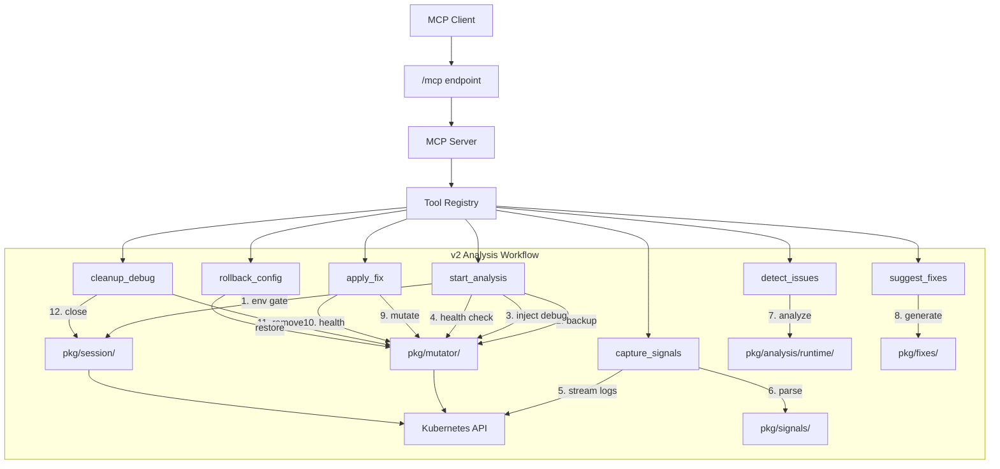

# Architecture Decision Document — otel-collector-mcp v2

_otel-collector-mcp v2 extends the existing MCP server from a static configuration linter into a dynamic pipeline analyzer capable of temporarily instrumenting live OTel Collectors in dev/staging environments to observe real signal data, detect runtime anti-patterns, and suggest targeted fixes._

## Project Context Analysis

### Requirements Overview

**Functional Requirements:**
56 FRs organized into 10 capability areas:
- **v1 Tool Preservation** (FR1-FR2): All 7 v1 tools unchanged, available regardless of v2 enablement
- **Safety & Environment Control** (FR3-FR9): Environment declaration gate, production refusal, config backup (ConfigMap annotation), rollback, automatic rollback on health failure, concurrent session rejection
- **Collector Health Monitoring** (FR10-FR13): Health check (Running, readiness, CrashLoopBackOff, processing), 30s crash detection, automatic post-mutation health check, per-pod status
- **Dynamic Analysis Workflow** (FR14-FR21): Debug exporter injection (append-only), ConfigMap/CRD mutation, rollout triggers, signal capture (30-120s), debug output parsing, cleanup, TTL-based auto-cleanup, orphaned session recovery on startup
- **Runtime Detection Rules** (FR22-FR30): 8 rules — high cardinality (>100 unique combos), PII (email/IP/CC/phone with false positive exclusion), orphan spans, bloated attributes (>1KB), missing resource attributes, duplicate signals, missing sampling, resource sizing
- **Fix Suggestion & Application** (FR31-FR37): OTTL transforms, filter rules, attributes processor, resource processor configs — each with complete YAML, target pipeline, risk assessment, individual user approval
- **Sampling & Sizing Recommendations** (FR38-FR40): Trace analysis with sampling strategy recommendation, resource estimation from observed throughput
- **Session Management** (FR41-FR44): Create/track/expire sessions, cross-tool state persistence, max concurrent sessions (default 5), session summary on cleanup
- **RBAC & Deployment** (FR45-FR48): `v2.enabled` Helm flag for write RBAC, configurable session TTL and max sessions, conditional tool visibility in MCP `tools/list`
- **Self-Instrumentation** (FR49-FR52): GenAI/MCP spans for all v2 tools, 8 new metrics (analysis duration, signal counts, detection hits, fixes applied, rollbacks, health checks, active backups), mutation structured logging with config diffs, safety gate WARN logs

**Non-Functional Requirements:**
- **Performance**: v2 tools <15s (excluding capture), `check_health` <5s, `rollback_config` <10s, `start_analysis` <30s (full cycle), signal parsing <5s for 100K data points, detection rules <10s
- **Security**: User-declared environment (no heuristics), absolute production refusal, opt-in write RBAC, PII values never in tool output, truncated signal samples in responses
- **Scalability**: 5 concurrent sessions, <100MB memory per session, immediate cleanup on session end, v1 tools unaffected during v2 sessions
- **Reliability**: 100% rollback success rate (most critical requirement), session recovery on restart, independent detection rule failure, clear K8s API error reporting, health check state discrimination (starting/crash/stuck/healthy)
- **Integration**: OTel Collector v0.90+ debug format, ConfigMap and CRD mutation, non-collector ConfigMap keys preserved, OTel Operator v0.90+ compatibility, GitOps annotation detection

**Scale & Complexity:**

- Primary domain: Go backend, Kubernetes-native MCP server (brownfield extension of v1)
- Complexity level: High — introduces controlled write operations, stateful sessions, live signal parsing, PII detection, automatic rollback, and RBAC escalation
- Estimated new architectural components: 5 packages (`pkg/session/`, `pkg/mutator/`, `pkg/signals/`, `pkg/analysis/runtime/`, `pkg/fixes/`)
- Existing components extended: `pkg/tools/` (10 new tools), `pkg/telemetry/` (8 new metrics), `pkg/config/` (v2 settings), Helm chart (v2 RBAC + values)

### Technical Constraints & Dependencies

- **v1 backward compatibility is absolute**: All 7 v1 tools, 12 static analyzers, and existing RBAC must work identically
- **v1 ADR-009 (Read-Only RBAC) is conditionally superseded**: v2 adds `update`/`patch` verbs but only when `v2.enabled=true`
- **Session state must be durable**: In-memory state for active workflows, ConfigMap annotation backup for crash recovery
- **Debug exporter format dependency**: Parser targets OTel Collector v0.90+ debug exporter stdout format — format changes are a versioning risk
- **ConfigMap mutation must be atomic**: Preserve non-collector data keys, handle concurrent access, detect GitOps controller annotations
- **CRD mutations must handle Operator validation**: The Operator may reject invalid `spec.config` — v2 must handle rejection gracefully
- **Rollout trigger mechanism differs by deployment type**: ConfigMap-based needs annotation-triggered rollout or pod deletion; CRD-based relies on Operator reconciliation

### Cross-Cutting Concerns Identified

- **Session lifecycle management**: Every v2 tool (except `check_health`) depends on session state. Sessions must be created, validated, expired, and recovered across server restarts.
- **Safety model enforcement**: The backup → mutate → health check → rollback chain is embedded in `start_analysis`, `apply_fix`, `cleanup_debug`, and `rollback_config`. The safety model is not a package — it's a behavioral contract across multiple packages.
- **Self-instrumentation (v2 extensions)**: 8 new metrics, child spans for multi-step operations (`start_analysis` has 5 child spans), structured logging for mutations — extends the v1 `pkg/telemetry/` framework.
- **Feature gating**: `v2.enabled` controls RBAC permissions (Helm), tool visibility (MCP server), and config options (session TTL, max sessions). This is a deployment-time decision with compile-time implications.
- **Concurrent access control**: Session locking per collector namespace/name to prevent concurrent analysis, ConfigMap update conflicts (optimistic concurrency via resourceVersion), and GitOps controller interference.
- **Error propagation and rollback**: Write operation failures must propagate clearly (K8s API error codes, not generic messages) and trigger appropriate rollback behavior.

## Technology Stack & Starter Foundation

### Primary Technology Domain

Go backend — in-cluster Kubernetes MCP server. Brownfield extension of the fully implemented v1 system. No starter template needed; the existing codebase provides ~60% of the infrastructure.

### Technology Stack (Inherited from v1)

| Technology | Version | Purpose |
|-----------|---------|---------|
| Go | 1.25.0 | Language runtime |
| MCP Go SDK | v1.3.1 | `github.com/modelcontextprotocol/go-sdk` — MCP protocol (Streamable HTTP) |
| client-go | v0.35.1 | `k8s.io/client-go` — Kubernetes API access (read + write for v2) |
| k8s API | v0.35.1 | `k8s.io/api` — Kubernetes API types |
| k8s apimachinery | v0.35.1 | `k8s.io/apimachinery` — Kubernetes type machinery |
| OTel Go SDK | v1.41.0 | `go.opentelemetry.io/otel` — Self-instrumentation (traces, metrics, logs) |
| OTel OTLP exporters | v1.40.0 | OTLP gRPC exporters for traces, metrics, logs |
| OTel HTTP instrumentation | v0.66.0 | `otelhttp` — HTTP handler instrumentation |
| OTel slog bridge | v0.15.0 | `otelslog` — slog → OTel log bridge |
| yaml.v3 | v3.0.1 | `gopkg.in/yaml.v3` — YAML parsing |
| slog | stdlib | Structured JSON logging |

### Rationale for Extending v1 (Not Starting Fresh)

The v1 codebase provides production-proven implementations of:
- MCP server lifecycle (Streamable HTTP handler, tool registration, health checks)
- CRD-based feature discovery with watch loop
- Dynamic tool registration/deregistration via thread-safe Registry
- Kubernetes client setup (in-cluster → kubeconfig fallback)
- `Tool` interface, `BaseTool` embedding, `StandardResponse` envelope
- `DiagnosticFinding` types for standardized diagnostic output
- `Analyzer` function signature for composable detection rules
- OTel self-instrumentation (GenAI/MCP semantic conventions, 5 metrics, slog bridge)
- Helm chart with RBAC, health probes, OTel integration, Gateway API

**v2 adds new packages alongside v1 — it does not rewrite or restructure existing code.**

### No New Dependencies Required

v2 uses only capabilities already available in the existing dependency tree:
- **ConfigMap/CRD writes**: `client-go` already supports `Update()`/`Patch()` — v1 only uses `Get()`/`List()`/`Watch()` but the client is already initialized
- **Pod log streaming**: Already implemented in `pkg/collector/logs.go`
- **YAML marshal/unmarshal**: Already using `gopkg.in/yaml.v3`
- **OTel metrics**: Already using `go.opentelemetry.io/otel/metric` — v2 adds new instruments to the existing `Metrics` struct
- **Regex for PII detection**: Go stdlib `regexp` package

## Core Architectural Decisions

### v1 ADRs Inherited (Unchanged)

The following v1 ADRs remain in effect for v2:
- **ADR-001**: MCP Transport — Streamable HTTP
- **ADR-002**: CRD-Based Discovery for OTel Operator Detection
- **ADR-003**: Collector Config Parsing via YAML Unmarshaling
- **ADR-004**: Log Parsing via Streaming Pod Logs (client-go)
- **ADR-005**: Detection Rules as Composable Analyzers
- **ADR-006**: Remediation as Part of DiagnosticFinding
- **ADR-008**: MCP Tools vs Prompts/Skills Boundary
- **ADR-010**: Multi-Cluster Identity in Every Response
- **ADR-011**: Gateway API Exposure via HTTPRoute
- **ADR-012**: CI/CD Pipeline Architecture (GitHub Actions)
- **ADR-013**: OTel GenAI + MCP Semantic Conventions for Self-Instrumentation

### v1 ADR Conditionally Superseded

- **ADR-009** (Read-Only RBAC): Superseded when `v2.enabled=true`. v2 adds `update`/`patch` verbs on ConfigMaps, OpenTelemetryCollector CRs, and apps workloads. When `v2.enabled=false` (default), v1's read-only RBAC applies unchanged.

### ADR-014: Session State Management

**Decision:** Use an in-memory session store (`sync.Map` keyed by session ID) with ConfigMap annotation backup for rollback durability. Sessions hold: session ID, collector reference, environment declaration, backup config, injected pipelines, captured signal data, detection findings, suggested fixes, and timestamps.

**Rationale:** v1 is stateless — every tool call is independent. v2's analysis workflow requires state that persists across 5-7 sequential tool calls (`start_analysis` → `capture_signals` → `detect_issues` → `suggest_fixes` → `apply_fix` → `cleanup_debug`). In-memory state is fast and sufficient for the active workflow. The backup config is additionally persisted as a ConfigMap annotation so it survives MCP server restarts — this is the one piece of state where loss would be catastrophic (orphaned debug exporter, no rollback possible).

**Session lifecycle:**
```
Created: start_analysis (generates UUID, stores backup)
Active: capture_signals, detect_issues, suggest_fixes, apply_fix
Expired: TTL timer (default 10min inactivity) → auto-cleanup
Closed: cleanup_debug (removes debug exporter, closes session)
Recovered: MCP server startup scans for ConfigMap annotations with active backup markers
```

**Consequences:** MCP server is no longer stateless. Memory usage grows with active sessions (~100MB max per session for captured signal data). Session recovery on restart requires scanning ConfigMaps for backup annotations.

### ADR-015: Safety Model Architecture — Environment Gate + Backup + Health + Rollback

**Decision:** Implement the safety model as a behavioral contract enforced by `pkg/session/` and `pkg/mutator/`, not as middleware or decorators. Every mutation path follows the same chain: validate environment → backup config → apply mutation → wait for rollout → health check → rollback on failure.

**Rationale:** The safety model is the most critical architectural element. It must be 100% reliable — a partial implementation or a missed code path is worse than no safety at all. Embedding the chain in the mutation and session packages (rather than as tool-level logic) ensures every write operation passes through the same safety gates.

**Environment gate rules:**
- User declares `dev`, `staging`, or `production` via `start_analysis` input
- `production` → absolute refusal, no override, no force flag
- No heuristic detection (no namespace name guessing, no label inference)
- The user is the authority on environment classification

**Backup strategy:**
- Before any mutation: snapshot full ConfigMap `.data` or CRD `.spec` (not just the collector YAML key)
- Store backup as annotation `mcp.otel.dev/config-backup` on the target ConfigMap/CRD
- Store session ID as annotation `mcp.otel.dev/session-id`
- Optimistic concurrency: use `resourceVersion` to detect concurrent modifications

**Health check contract:**
- After every mutation + rollout: poll pod status for up to 30 seconds
- Healthy = pod Running + readiness probe passing + no CrashLoopBackOff in last 30s
- Unhealthy = CrashLoopBackOff detected OR readiness probe failing after 30s
- On unhealthy: automatic rollback (restore backup, trigger rollout, verify recovery)

**Consequences:** Every v2 mutation tool depends on both `pkg/session/` and `pkg/mutator/`. The safety chain adds 15-30 seconds to mutation operations (rollout + health check wait). Backup annotations increase ConfigMap size slightly.

### ADR-016: Config Mutation Strategy — ConfigMap + CRD + Rollout Triggers

**Decision:** `pkg/mutator/` handles both ConfigMap-based and CRD-based collectors with a unified `Mutator` interface that abstracts the mutation and rollout trigger differences.

**Rationale:** ConfigMap-based and CRD-based collectors have fundamentally different mutation and rollout mechanisms. ConfigMaps require explicit rollout triggers (annotation-based restart); CRDs rely on the Operator's reconciliation loop. The mutator must handle both transparently so tools don't need to know the deployment type.

**Interface design:**
```go
type Mutator interface {
    Backup(ctx context.Context, session *Session) error
    ApplyConfig(ctx context.Context, session *Session, newConfig []byte) error
    Rollback(ctx context.Context, session *Session) error
    TriggerRollout(ctx context.Context, session *Session) error
    Cleanup(ctx context.Context, session *Session) error
}
```

**ConfigMap mutation path:**
1. `Update()` the ConfigMap `.data[key]` with new collector YAML (preserving other keys)
2. Trigger rollout by patching the owning Deployment/DaemonSet/StatefulSet with annotation `kubectl.kubernetes.io/restartedAt: <timestamp>`
3. Wait for rollout + health check

**CRD mutation path:**
1. `Patch()` the OpenTelemetryCollector CR `.spec.config` with new collector YAML
2. Operator handles rollout automatically (no explicit trigger needed)
3. Wait for rollout + health check

**GitOps detection:**
- Before mutation: check for `argocd.argoproj.io/managed-by` or `fluxcd.io/automated` annotations
- If found: warn user that GitOps may revert changes, but proceed if user confirms

**Consequences:** Two concrete `Mutator` implementations (ConfigMap, CRD). The tool layer calls the same interface regardless of deployment type. ConfigMap key detection must handle different naming conventions (e.g., `relay` for Helm-deployed collectors, `collector.yaml` for manual deployments).

### ADR-017: Debug Exporter Injection — Append-Only Pipeline Modification

**Decision:** Debug exporter injection modifies only the exporters section and pipeline exporter references. It appends `debug` exporter with `verbosity: basic` to the config and adds `debug` to targeted pipeline exporter lists. It never modifies receivers, processors, or existing exporters.

**Rationale:** Minimizing the blast radius of config modification is essential for safety. Append-only changes to the exporter list are the simplest possible mutation — easy to inject, easy to detect, easy to remove. The debug exporter with `verbosity: basic` writes structured output to stdout without causing excessive memory usage.

**Injection logic:**
```yaml
# Added to exporters section
exporters:
  debug:
    verbosity: basic

# Added to each targeted pipeline's exporters list
service:
  pipelines:
    metrics:
      exporters: [otlp, debug]  # 'debug' appended
```

**Cleanup logic:**
- Remove `debug` key from `exporters` section
- Remove `debug` from each pipeline's exporters list
- Preserve any user-approved fixes that were applied during the session
- If `debug` exporter already existed in config before injection: skip injection, warn user

**Consequences:** Simple, predictable, reversible. Cannot conflict with existing config. Cleanup is straightforward string removal from YAML.

### ADR-018: Signal Parsing — Debug Exporter Stdout to Structured Data

**Decision:** New `pkg/signals/` package parses OTel Collector debug exporter stdout (verbosity: basic) into Go structs representing metrics, logs, and traces. Parsing targets collector v0.90+ output format.

**Rationale:** The debug exporter writes structured but text-formatted telemetry data to stdout. v2 must parse this into structured Go types for detection rule analysis. A dedicated parser package isolates the format-dependent parsing from the detection rules, making it possible to support future format changes without modifying analyzers.

**Data models:**
```go
type CapturedSignals struct {
    Metrics []MetricDataPoint
    Logs    []LogRecord
    Traces  []SpanData
}

type MetricDataPoint struct {
    Name       string
    Type       string  // gauge, sum, histogram
    Labels     map[string]string
    Value      float64
    Timestamp  time.Time
}

type LogRecord struct {
    Body       string
    Severity   string
    Attributes map[string]string
    Resource   map[string]string
    Timestamp  time.Time
}

type SpanData struct {
    TraceID      string
    SpanID       string
    ParentSpanID string
    Name         string
    Kind         string
    Attributes   map[string]string
    Resource     map[string]string
    StartTime    time.Time
    EndTime      time.Time
    Status       string
}
```

**Capture mechanism:**
- `capture_signals` streams pod stdout via `client-go GetLogs()` with `Follow: true` for the configured duration (30-120s)
- Parser processes lines as they arrive, building the `CapturedSignals` struct
- Parsing errors on individual lines are logged and skipped (never fail the entire capture)

**Consequences:** Parser is tightly coupled to debug exporter output format. Must be tested against multiple collector versions. Memory usage proportional to captured data volume (bounded by capture duration and `verbosity: basic`).

### ADR-019: Runtime Detection Rules — Extending v1 Analyzer Pattern

**Decision:** v2 runtime detection rules live in `pkg/analysis/runtime/` as functions with a new signature that accepts `CapturedSignals` instead of v1's `AnalysisInput`. They follow v1's composable analyzer pattern but operate on live signal data rather than static config.

**Rationale:** v1's `Analyzer` function signature (`func(ctx, *AnalysisInput) []DiagnosticFinding`) is designed for static config analysis. v2 rules need access to captured signal data. A new signature keeps the runtime rules cleanly separated while reusing the same `DiagnosticFinding` output type.

**Runtime analyzer signature:**
```go
type RuntimeAnalyzer func(ctx context.Context, input *RuntimeAnalysisInput) []types.DiagnosticFinding

type RuntimeAnalysisInput struct {
    Signals      *signals.CapturedSignals
    Config       *collector.CollectorConfig
    DeployMode   collector.DeploymentMode
    SessionID    string
}
```

**8 runtime detection rules:**
1. `AnalyzeHighCardinality` — count unique label combos per metric, flag >100
2. `AnalyzePII` — regex scan log bodies/attributes for email, IP, CC, phone; exclude trace IDs and OTel semconv values
3. `AnalyzeOrphanSpans` — find spans with no parent AND no children in window
4. `AnalyzeBloatedAttributes` — flag attribute values >1KB or extremely high unique counts
5. `AnalyzeMissingResourceAttributes` — check for `service.name`, `service.version`, `deployment.environment`
6. `AnalyzeDuplicateSignals` — detect identical metric names from different sources
7. `AnalyzeMissingSampling` — detect absence of sampling processor, prompt user
8. `AnalyzeResourceSizing` — compare observed throughput vs. resource limits

**Consequences:** Two analyzer registries (static in `pkg/analysis/`, runtime in `pkg/analysis/runtime/`). Both produce `DiagnosticFinding` — tools and the MCP server don't need to know the difference. Runtime rules can reuse v1 helpers from `pkg/analysis/helpers.go`.

### ADR-020: Fix Generation — OTTL, Filter, and Processor Config Generation

**Decision:** New `pkg/fixes/` package generates fix suggestions from detection findings. Each fix generator maps to a detection rule type and produces complete YAML config blocks with risk assessments.

**Rationale:** Fix generation is the complement to detection. Separating it from detection rules keeps the rules focused on finding problems and the fix generators focused on producing valid configs. Each fix must include a complete, ready-to-apply processor config block — not just a description.

**Fix generator interface:**
```go
type FixGenerator func(finding types.DiagnosticFinding, config *collector.CollectorConfig) *FixSuggestion

type FixSuggestion struct {
    FindingIndex    int
    FixType         string  // ottl, filter, attribute, resource, config
    Description     string
    ProcessorConfig string  // Complete YAML block
    PipelineChanges string  // Where to add the processor
    Risk            string  // low, medium, high
}
```

**Fix types by detection rule:**
- High cardinality → `attributes` processor to drop/aggregate high-cardinality labels
- PII → `transform` processor with OTTL `replace_pattern` or `delete_key`
- Orphan spans → informational (no automated fix — needs instrumentation changes)
- Bloated attributes → `transform` processor to truncate or delete oversized attributes
- Missing resource → `resource` processor to add missing attributes
- Duplicate signals → `filter` processor to deduplicate
- Missing sampling → generate `tail_sampling` or `probabilistic_sampler` processor config
- Resource sizing → resource requests/limits recommendation (not a config fix)

**Consequences:** Fix generators must produce syntactically valid YAML. Fixes that involve OTTL must generate valid OTTL expressions. The risk assessment is based on fix type: `ottl` = medium (syntax risk), `filter` = low, `attribute` = low, `resource` = low.

### ADR-021: Feature Gating — `v2.enabled` Controls RBAC, Tools, and Config

**Decision:** A single `V2_ENABLED` environment variable (set via Helm `v2.enabled`) controls three things: (1) whether v2 write RBAC is included in the Helm chart, (2) whether v2 tools are registered in the MCP tool registry, (3) whether v2 config options (sessionTTL, maxConcurrentSessions) are read.

**Rationale:** Clusters that only want v1 functionality should not grant write permissions or expose mutation tools. A single feature gate keeps the opt-in simple and auditable.

**Helm chart implementation:**
```yaml
# values.yaml
v2:
  enabled: false
  sessionTTL: "10m"
  maxConcurrentSessions: 5

# clusterrole.yaml
{{- if .Values.v2.enabled }}
# v2 write permissions
- apiGroups: [""]
  resources: [configmaps]
  verbs: [update, patch]
- apiGroups: [opentelemetry.io]
  resources: [opentelemetrycollectors]
  verbs: [update, patch]
- apiGroups: [apps]
  resources: [daemonsets, deployments, statefulsets]
  verbs: [patch]
{{- end }}
```

**Tool registration:**
```go
if cfg.V2Enabled {
    registry.Register(&tools.StartAnalysisTool{...})
    registry.Register(&tools.CaptureSignalsTool{...})
    // ... all 10 v2 tools
}
```

**Consequences:** v2 tools are invisible to MCP clients when disabled. No write RBAC is granted. The MCP server binary is the same regardless of v2 enablement — it's purely a runtime configuration decision.

### ADR-022: v2 Self-Instrumentation Extensions

**Decision:** Extend `pkg/telemetry/metrics.go` with 8 new metric instruments for v2 operations. v2 tools use the same span instrumentation path as v1 (via `pkg/mcp/server.go`'s `buildInstrumentedHandler`), with additional child spans for multi-step operations.

**Rationale:** v1's self-instrumentation framework (ADR-013) already handles per-tool spans, GenAI/MCP semantic conventions, and metric recording. v2 extends this with domain-specific metrics and finer-grained span hierarchies for multi-step tools like `start_analysis`.

**New metrics:**
```go
// Added to existing Metrics struct in pkg/telemetry/metrics.go
AnalysisDuration      metric.Float64Histogram  // mcp.analysis.duration_seconds
AnalysisSessionsTotal metric.Int64Counter      // mcp.analysis.sessions_total
CaptureSignalsTotal   metric.Int64Counter      // mcp.capture.signals_total
DetectionHitsTotal    metric.Int64Counter      // mcp.detection.hits_total
FixesAppliedTotal     metric.Int64Counter      // mcp.fixes.applied_total
RollbacksTotal        metric.Int64Counter      // mcp.rollbacks.total
HealthChecksTotal     metric.Int64Counter      // mcp.health_checks.total
BackupActive          metric.Int64Gauge        // mcp.backup.active
```

**Child span pattern for multi-step tools:**
```go
// In start_analysis tool:
ctx, span := tracer.Start(ctx, "execute_tool start_analysis")
defer span.End()

// Child spans for each phase:
_, envSpan := tracer.Start(ctx, "validate_environment")
// ... validate ...
envSpan.End()

_, backupSpan := tracer.Start(ctx, "config_backup")
// ... backup ...
backupSpan.End()
```

**Consequences:** No new dependencies. The existing v1 telemetry initialization handles all 3 signals. v2 metrics appear automatically when the MCP server exports to an OTLP endpoint. Child spans provide fine-grained latency visibility into multi-step operations.

### Decision Priority Analysis

**Critical Decisions (Block Implementation):**
- ADR-014: Session State Management
- ADR-015: Safety Model Architecture
- ADR-016: Config Mutation Strategy
- ADR-021: Feature Gating (`v2.enabled`)

**Important Decisions (Shape Architecture):**
- ADR-017: Debug Exporter Injection
- ADR-018: Signal Parsing
- ADR-019: Runtime Detection Rules
- ADR-020: Fix Generation
- ADR-022: v2 Self-Instrumentation

**Deferred Decisions (Post-MVP):**
- Custom PII patterns (user-configurable regex) — Phase 2
- Continuous monitoring mode — Phase 2
- Multi-collector topology analysis — Phase 2
- Production-safe read-only analysis (zpages) — Phase 3
- Community detection rule plugin system — Phase 3

## Implementation Patterns & Consistency Rules

### v1 Patterns Inherited (Unchanged)

All v1 patterns remain in effect. Key ones for reference:
- **Go Package Naming**: lowercase, single word (`tools`, `analysis`, `session`, `mutator`)
- **Go Code Naming**: PascalCase types/exported, camelCase unexported
- **MCP Tool Naming**: `verb_noun` snake_case (`start_analysis`, `capture_signals`, `detect_issues`)
- **File Naming**: `tool_<name>.go` for tools, `analyzer_<name>.go` for analyzers
- **Tool Implementation**: All tools embed `BaseTool`, implement `Tool` interface, return `*StandardResponse`
- **Error Handling**: `types.MCPError` for structured errors, partial results preferred over hard failures
- **Logging**: `slog` with structured fields, never `fmt.Printf`
- **Timestamp**: RFC3339 UTC

### v2 Naming Patterns

**v2 Tool File Naming:**
- Format: `tool_v2_<name>.go` to visually distinguish from v1 tools
- Examples: `tool_v2_start_analysis.go`, `tool_v2_capture_signals.go`, `tool_v2_apply_fix.go`
- Tests co-located: `tool_v2_start_analysis_test.go`

**v2 Runtime Analyzer File Naming:**
- Location: `pkg/analysis/runtime/`
- Format: `analyzer_<name>.go` (same pattern as v1 static analyzers)
- Examples: `analyzer_high_cardinality.go`, `analyzer_pii.go`, `analyzer_orphan_spans.go`
- Registry: `analyzer.go` containing `RuntimeAnalyzer` type and `AllRuntimeAnalyzers()` function

**Session and Mutator Naming:**
- Session IDs: UUID v4 format (e.g., `a1b2c3d4-e5f6-7890-abcd-ef1234567890`)
- ConfigMap annotation keys: `mcp.otel.dev/` prefix (e.g., `mcp.otel.dev/config-backup`, `mcp.otel.dev/session-id`)
- Mutator implementations: `ConfigMapMutator`, `CRDMutator` (concrete types implementing `Mutator` interface)

**Fix Generator File Naming:**
- Location: `pkg/fixes/`
- Format: `fix_<type>.go`
- Examples: `fix_cardinality.go`, `fix_pii.go`, `fix_missing_resource.go`

### v2 Structure Patterns

**v2 Tool Implementation Pattern:**
All v2 tools embed `BaseTool` AND hold a reference to the session manager:
```go
type StartAnalysisTool struct {
    tools.BaseTool
    Sessions *session.Manager
    Mutator  mutator.Factory  // Returns ConfigMapMutator or CRDMutator
}
```

**Session-Aware Tool Pattern:**
Every v2 tool (except `check_health`) validates session state before executing:
```go
func (t *CaptureSignalsTool) Run(ctx context.Context, args map[string]interface{}) (*types.StandardResponse, error) {
    sessionID, _ := args["session_id"].(string)
    sess, err := t.Sessions.Get(sessionID)
    if err != nil {
        return nil, types.NewMCPError(types.ErrCodeSessionNotFound, "session not found: "+sessionID)
    }
    // ... proceed with active session
}
```

**Mutator Factory Pattern:**
The mutator factory returns the correct implementation based on deployment mode:
```go
func NewMutator(clients *k8s.Clients, mode collector.DeploymentMode) Mutator {
    if mode == collector.ModeOperatorCRD {
        return &CRDMutator{Clients: clients}
    }
    return &ConfigMapMutator{Clients: clients}
}
```

**Safety Chain Pattern (mandatory for all mutation operations):**
```go
// Every mutation follows this chain — no exceptions
func (m *ConfigMapMutator) SafeApply(ctx context.Context, sess *Session, newConfig []byte) error {
    if err := m.Backup(ctx, sess); err != nil {
        return fmt.Errorf("backup failed: %w", err)
    }
    if err := m.ApplyConfig(ctx, sess, newConfig); err != nil {
        return fmt.Errorf("apply failed: %w", err)
    }
    if err := m.TriggerRollout(ctx, sess); err != nil {
        _ = m.Rollback(ctx, sess) // Best-effort rollback
        return fmt.Errorf("rollout trigger failed: %w", err)
    }
    if err := m.WaitHealthy(ctx, sess); err != nil {
        _ = m.Rollback(ctx, sess) // Automatic rollback on health failure
        return fmt.Errorf("health check failed, rolled back: %w", err)
    }
    return nil
}
```

### v2 Format Patterns

**v2 Tool Response Data:**
v2 tools return `*StandardResponse` with v2-specific data structures:
```go
// All v2 tool responses use the same StandardResponse envelope as v1
// The Data field contains tool-specific structs (not raw maps)
type AnalysisSessionData struct {
    SessionID         string       `json:"session_id"`
    Environment       string       `json:"environment"`
    BackupID          string       `json:"backup_id"`
    Collector         CollectorRef `json:"collector"`
    InjectedPipelines []string     `json:"injected_pipelines"`
    Status            string       `json:"status"`
}
```

**Status field convention:**
Every v2 tool response includes a `status` string field indicating the outcome:
- `ready_for_capture`, `capture_complete`, `detection_complete` — workflow progression
- `fix_applied`, `rolled_back` — mutation outcomes
- `cleanup_complete` — session termination
- `healthy`, `unhealthy`, `crash_loop`, `not_found` — health check results

**Error code additions for v2:**
```go
const (
    ErrCodeSessionNotFound    = "session_not_found"
    ErrCodeSessionExpired     = "session_expired"
    ErrCodeConcurrentSession  = "concurrent_session"
    ErrCodeProductionRefused  = "production_refused"
    ErrCodeBackupFailed       = "backup_failed"
    ErrCodeRollbackFailed     = "rollback_failed"
    ErrCodeHealthCheckFailed  = "health_check_failed"
    ErrCodeMutationFailed     = "mutation_failed"
    ErrCodeCaptureFailed      = "capture_failed"
    ErrCodeGitOpsConflict     = "gitops_conflict"
)
```

### v2 Process Patterns

**Health Check Polling Pattern:**
```go
func WaitHealthy(ctx context.Context, clients *k8s.Clients, namespace, name string, timeout time.Duration) error {
    deadline := time.After(timeout)
    ticker := time.NewTicker(2 * time.Second)
    defer ticker.Stop()
    for {
        select {
        case <-deadline:
            return fmt.Errorf("health check timed out after %s", timeout)
        case <-ticker.C:
            status := checkPodHealth(ctx, clients, namespace, name)
            if status == Healthy { return nil }
            if status == CrashLoop { return fmt.Errorf("CrashLoopBackOff detected") }
        case <-ctx.Done():
            return ctx.Err()
        }
    }
}
```

**Session TTL Cleanup Pattern:**
```go
// Background goroutine started once at server init
func (m *Manager) startCleanupLoop(ctx context.Context) {
    ticker := time.NewTicker(30 * time.Second)
    for {
        select {
        case <-ticker.C:
            m.expireSessions(ctx) // Removes debug exporters from expired sessions
        case <-ctx.Done():
            return
        }
    }
}
```

**Logging Patterns for v2 Mutations:**
```go
// All mutations log at INFO with before/after context
slog.InfoContext(ctx, "config mutation applied",
    "session_id", sess.ID,
    "collector", sess.CollectorName,
    "namespace", sess.Namespace,
    "mutation_type", "debug_exporter_inject",
)

// Safety gate decisions log at WARN
slog.WarnContext(ctx, "production environment refused",
    "session_id", sess.ID,
    "environment", "production",
    "collector", sess.CollectorName,
)

// Rollbacks log at WARN with reason
slog.WarnContext(ctx, "automatic rollback triggered",
    "session_id", sess.ID,
    "reason", "CrashLoopBackOff",
    "collector", sess.CollectorName,
)
```

### Enforcement Guidelines

**All AI Agents MUST:**
- Follow `BaseTool` embedding + session manager reference for all v2 tools
- Use the `Mutator` interface for ALL config changes — never write directly to ConfigMaps/CRDs
- Include the safety chain (backup → apply → rollout → health → rollback) for every mutation path
- Validate session state at the start of every v2 tool (except `check_health`)
- Use `mcp.otel.dev/` prefix for all ConfigMap/CRD annotations
- Return `StandardResponse` with a `status` field from all v2 tools
- Write `_test.go` files co-located with every new tool, analyzer, and fix generator
- Use the `RuntimeAnalyzer` function signature for all v2 detection rules
- Never include actual PII values in tool responses — report PII type and attribute key only
- Log all mutations at INFO with structured context, all safety refusals at WARN

## Project Structure & Boundaries

### Complete Project Directory Structure

```
otel-collector-mcp/
├── cmd/
│   └── server/
│       └── main.go                          # Extended: v2 tool registration, session manager init
├── pkg/
│   ├── analysis/                            # v1 static analyzers (UNCHANGED)
│   │   ├── analyzer.go                      # Analyzer type, AnalysisInput, AllAnalyzers()
│   │   ├── helpers.go                       # Shared utilities (reused by v2 runtime rules)
│   │   ├── analyzer_missing_batch.go
│   │   ├── analyzer_missing_memory_limiter.go
│   │   ├── analyzer_hardcoded_tokens.go
│   │   ├── analyzer_missing_retry_queue.go
│   │   ├── analyzer_receiver_bindings.go
│   │   ├── analyzer_tail_sampling_daemonset.go
│   │   ├── analyzer_invalid_regex.go
│   │   ├── analyzer_connector_misconfig.go
│   │   ├── analyzer_resource_detector_conflicts.go
│   │   ├── analyzer_cumulative_delta.go
│   │   ├── analyzer_high_cardinality.go
│   │   ├── analyzer_exporter_backpressure.go
│   │   └── *_test.go
│   │
│   ├── analysis/runtime/                    # NEW: v2 runtime detection rules
│   │   ├── analyzer.go                      # RuntimeAnalyzer type, RuntimeAnalysisInput, AllRuntimeAnalyzers()
│   │   ├── analyzer_high_cardinality.go     # >100 unique label combos per metric
│   │   ├── analyzer_high_cardinality_test.go
│   │   ├── analyzer_pii.go                  # Email, IP, CC, phone regex with false positive exclusion
│   │   ├── analyzer_pii_test.go
│   │   ├── analyzer_orphan_spans.go         # Spans with no parent AND no children
│   │   ├── analyzer_orphan_spans_test.go
│   │   ├── analyzer_bloated_attrs.go        # Values >1KB, high unique counts
│   │   ├── analyzer_bloated_attrs_test.go
│   │   ├── analyzer_missing_resource.go     # service.name, service.version, deployment.environment
│   │   ├── analyzer_missing_resource_test.go
│   │   ├── analyzer_duplicate_signals.go    # Identical metric names from different sources
│   │   ├── analyzer_duplicate_signals_test.go
│   │   ├── analyzer_missing_sampling.go     # No sampling processor configured
│   │   ├── analyzer_missing_sampling_test.go
│   │   ├── analyzer_resource_sizing.go      # Throughput vs resource limits
│   │   └── analyzer_resource_sizing_test.go
│   │
│   ├── collector/                           # v1 (UNCHANGED)
│   │   ├── config.go
│   │   ├── config_test.go
│   │   ├── detect.go
│   │   └── logs.go
│   │
│   ├── config/                              # Extended: v2 config fields
│   │   ├── config.go                        # Extended: V2Enabled, SessionTTL, MaxConcurrentSessions
│   │   └── config_test.go
│   │
│   ├── discovery/                           # v1 (UNCHANGED)
│   │   └── discovery.go
│   │
│   ├── fixes/                               # NEW: Fix suggestion generation
│   │   ├── types.go                         # FixGenerator, FixSuggestion types
│   │   ├── fix_cardinality.go               # Attributes processor to drop high-cardinality labels
│   │   ├── fix_cardinality_test.go
│   │   ├── fix_pii.go                       # OTTL replace_pattern / delete_key for PII
│   │   ├── fix_pii_test.go
│   │   ├── fix_missing_resource.go          # Resource processor to add missing attributes
│   │   ├── fix_missing_resource_test.go
│   │   ├── fix_bloated_attrs.go             # Transform processor to truncate/delete
│   │   ├── fix_bloated_attrs_test.go
│   │   ├── fix_duplicate_signals.go         # Filter processor to deduplicate
│   │   ├── fix_duplicate_signals_test.go
│   │   ├── fix_sampling.go                  # Tail sampling / probabilistic config generation
│   │   └── fix_sampling_test.go
│   │
│   ├── k8s/                                 # v1 (UNCHANGED)
│   │   └── client.go
│   │
│   ├── mcp/                                 # v1 (UNCHANGED — v2 tools auto-instrumented)
│   │   └── server.go
│   │
│   ├── mutator/                             # NEW: Config mutation + rollout + rollback
│   │   ├── types.go                         # Mutator interface, Factory function
│   │   ├── configmap.go                     # ConfigMapMutator: backup, apply, rollout, rollback
│   │   ├── configmap_test.go
│   │   ├── crd.go                           # CRDMutator: backup, apply (Operator rollout), rollback
│   │   ├── crd_test.go
│   │   ├── health.go                        # WaitHealthy(), checkPodHealth(), health status types
│   │   ├── health_test.go
│   │   ├── inject.go                        # InjectDebugExporter(), RemoveDebugExporter()
│   │   └── inject_test.go
│   │
│   ├── session/                             # NEW: Analysis session lifecycle
│   │   ├── manager.go                       # Manager: Create, Get, Expire, Recover, cleanup loop
│   │   ├── manager_test.go
│   │   ├── types.go                         # Session struct, SessionState enum
│   │   └── recovery.go                      # Startup recovery: scan ConfigMap annotations
│   │
│   ├── signals/                             # NEW: Debug exporter output parsing
│   │   ├── types.go                         # CapturedSignals, MetricDataPoint, LogRecord, SpanData
│   │   ├── parser.go                        # ParseDebugOutput() — line-by-line stdout parser
│   │   ├── parser_test.go
│   │   ├── parser_metrics.go                # Metric-specific parsing logic
│   │   ├── parser_logs.go                   # Log-specific parsing logic
│   │   └── parser_traces.go                 # Trace/span-specific parsing logic
│   │
│   ├── skills/                              # v1 (UNCHANGED)
│   │   ├── registry.go
│   │   ├── types.go
│   │   ├── skill_architecture.go
│   │   └── skill_ottl.go
│   │
│   ├── telemetry/                           # Extended: v2 metrics
│   │   ├── telemetry.go                     # v1 (UNCHANGED)
│   │   └── metrics.go                       # Extended: 8 new v2 metric instruments
│   │
│   ├── tools/                               # Extended: 10 new v2 tools
│   │   ├── registry.go                      # v1 (UNCHANGED)
│   │   ├── types.go                         # v1 (UNCHANGED)
│   │   ├── tool_triage.go                   # v1 (UNCHANGED)
│   │   ├── tool_detect_deployment.go        # v1 (UNCHANGED)
│   │   ├── tool_list_collectors.go          # v1 (UNCHANGED)
│   │   ├── tool_get_config.go               # v1 (UNCHANGED)
│   │   ├── tool_parse_logs.go               # v1 (UNCHANGED)
│   │   ├── tool_parse_operator_logs.go      # v1 (UNCHANGED)
│   │   ├── tool_check_config.go             # v1 (UNCHANGED)
│   │   ├── tool_v2_start_analysis.go        # NEW: Safety gate + backup + debug inject
│   │   ├── tool_v2_start_analysis_test.go
│   │   ├── tool_v2_capture_signals.go       # NEW: Stream debug output, parse signals
│   │   ├── tool_v2_capture_signals_test.go
│   │   ├── tool_v2_detect_issues.go         # NEW: Run runtime detection rules
│   │   ├── tool_v2_detect_issues_test.go
│   │   ├── tool_v2_suggest_fixes.go         # NEW: Generate fix suggestions
│   │   ├── tool_v2_suggest_fixes_test.go
│   │   ├── tool_v2_apply_fix.go             # NEW: Apply user-approved fix
│   │   ├── tool_v2_apply_fix_test.go
│   │   ├── tool_v2_rollback_config.go       # NEW: Restore backup config
│   │   ├── tool_v2_rollback_config_test.go
│   │   ├── tool_v2_cleanup_debug.go         # NEW: Remove debug exporter, close session
│   │   ├── tool_v2_cleanup_debug_test.go
│   │   ├── tool_v2_check_health.go          # NEW: Pod health status check
│   │   ├── tool_v2_check_health_test.go
│   │   ├── tool_v2_recommend_sampling.go    # NEW: Sampling strategy recommendation
│   │   ├── tool_v2_recommend_sampling_test.go
│   │   ├── tool_v2_recommend_sizing.go      # NEW: Resource sizing recommendation
│   │   └── tool_v2_recommend_sizing_test.go
│   │
│   └── types/                               # Extended: v2 error codes
│       ├── findings.go                      # v1 (UNCHANGED)
│       ├── errors.go                        # Extended: v2 error codes
│       └── metadata.go                      # v1 (UNCHANGED)
│
├── deploy/
│   ├── helm/
│   │   └── otel-collector-mcp/
│   │       ├── Chart.yaml                   # Version bump for v2
│   │       ├── values.yaml                  # Extended: v2.enabled, v2.sessionTTL, v2.maxConcurrentSessions
│   │       └── templates/
│   │           ├── deployment.yaml          # Extended: V2_ENABLED, V2_SESSION_TTL, V2_MAX_SESSIONS env vars
│   │           ├── service.yaml             # UNCHANGED
│   │           ├── serviceaccount.yaml      # UNCHANGED
│   │           ├── clusterrole.yaml         # Extended: conditional v2 write permissions
│   │           ├── clusterrolebinding.yaml  # UNCHANGED
│   │           ├── httproute.yaml           # UNCHANGED
│   │           └── _helpers.tpl             # UNCHANGED
│   └── kubernetes/                          # Extended: v2 RBAC variant
│       ├── namespace.yaml
│       ├── serviceaccount.yaml
│       ├── rbac.yaml                        # Extended: optional v2 write permissions
│       ├── deployment.yaml                  # Extended: v2 env vars
│       ├── service.yaml
│       └── kustomization.yaml
│
├── docs/                                    # Extended: v2 documentation
│   ├── mkdocs.yml                           # Extended: v2 tool reference pages
│   └── docs/
│       ├── index.md                         # Updated: mention v2 capabilities
│       ├── getting-started.md               # Updated: v2 enablement instructions
│       ├── tools/
│       │   └── index.md                     # Extended: 10 v2 tool reference entries
│       ├── skills/
│       │   └── index.md                     # UNCHANGED
│       ├── architecture/
│       │   └── index.md                     # Extended: v2 data flow, safety model diagram
│       ├── v2/                              # NEW: v2-specific documentation
│       │   ├── safety-model.md              # Safety model guide
│       │   ├── detection-rules.md           # Runtime detection rules reference
│       │   └── migration.md                 # v1 → v2 migration guide
│       ├── contributing.md                  # Updated: adding runtime rules, fix generators
│       └── troubleshooting.md              # Updated: v2 troubleshooting
│
├── go.mod                                   # UNCHANGED (no new deps)
├── go.sum                                   # UNCHANGED
├── Makefile                                 # UNCHANGED
├── Dockerfile                               # UNCHANGED
└── .github/
    └── workflows/                           # UNCHANGED
        ├── ci.yml
        ├── docker.yml
        ├── docs.yml
        └── release.yml
```

### Architectural Boundaries

**API Boundaries:**
- Single MCP endpoint: `/mcp` (Streamable HTTP) — serves both v1 and v2 tools
- Health check endpoints: `/healthz`, `/readyz` — unchanged
- No new API surfaces — all v2 functionality exposed via MCP tools

**Package Boundaries (v2 additions):**
- `pkg/session/` → depends on `pkg/mutator/`, `pkg/k8s/`, `pkg/config/`
- `pkg/mutator/` → depends on `pkg/k8s/`, `pkg/collector/` (for DeploymentMode)
- `pkg/signals/` → no internal dependencies (leaf package — only stdlib)
- `pkg/analysis/runtime/` → depends on `pkg/signals/`, `pkg/collector/`, `pkg/types/`
- `pkg/fixes/` → depends on `pkg/collector/`, `pkg/types/`
- `pkg/tools/` (v2 tools) → depends on `pkg/session/`, `pkg/mutator/`, `pkg/signals/`, `pkg/analysis/runtime/`, `pkg/fixes/`

**Dependency rule:** No v2 package depends on `pkg/tools/`. No v1 package depends on any v2 package. The dependency graph is acyclic.

**Data Flow (v2 analysis workflow):**


### Requirements to Structure Mapping

| FR Category | Package / Location | Key Files |
|------------|-------------------|-----------|
| v1 Tool Preservation (FR1-FR2) | `pkg/tools/` (existing) | All v1 `tool_*.go` unchanged |
| Safety & Environment (FR3-FR9) | `pkg/session/`, `pkg/mutator/` | `manager.go`, `types.go`, `configmap.go`, `crd.go` |
| Health Monitoring (FR10-FR13) | `pkg/mutator/` | `health.go` |
| Dynamic Analysis (FR14-FR21) | `pkg/tools/`, `pkg/mutator/`, `pkg/signals/` | `tool_v2_start_analysis.go`, `inject.go`, `parser.go` |
| Runtime Detection (FR22-FR30) | `pkg/analysis/runtime/` | `analyzer_*.go` (8 files) |
| Fix Suggestion (FR31-FR37) | `pkg/fixes/`, `pkg/tools/` | `fix_*.go`, `tool_v2_suggest_fixes.go`, `tool_v2_apply_fix.go` |
| Sampling & Sizing (FR38-FR40) | `pkg/tools/`, `pkg/fixes/` | `tool_v2_recommend_sampling.go`, `tool_v2_recommend_sizing.go` |
| Session Management (FR41-FR44) | `pkg/session/` | `manager.go`, `recovery.go` |
| RBAC & Deployment (FR45-FR48) | `deploy/helm/`, `pkg/config/` | `clusterrole.yaml`, `values.yaml`, `config.go` |
| Self-Instrumentation (FR49-FR52) | `pkg/telemetry/`, `pkg/mcp/` | `metrics.go` (extended), `server.go` (unchanged — auto-instruments) |
| Documentation (FR53-FR56) | `docs/` | `docs/v2/safety-model.md`, `docs/v2/detection-rules.md`, `docs/v2/migration.md` |

### Integration Points

**Internal Communication:**
- v2 tools invoke session manager, mutator, and signal parser directly (function calls, no RPC)
- Session manager invokes mutator for TTL-based cleanup (cleanup expired debug exporters)
- Session recovery on startup uses mutator to clean orphaned sessions
- CRD discovery (v1) still controls whether CRD-based mutator is available

**External Integrations:**
- Kubernetes API (client-go): v1 read operations + v2 write operations (ConfigMap update, CRD patch, workload annotation patch)
- OTel Operator API: v2 CRD mutations trigger Operator reconciliation
- OTLP endpoint (optional): v2 metrics exported alongside v1 telemetry

## Architecture Validation Results

### Coherence Validation

**Decision Compatibility:**
All v2 decisions are compatible with each other and with v1's inherited ADRs:
- ADR-014 (Sessions) + ADR-015 (Safety) + ADR-016 (Mutator) form a coherent safety chain — sessions hold backup state, mutators enforce the safety contract, and health checks trigger automatic rollback
- ADR-017 (Debug Injection) + ADR-018 (Signal Parsing) + ADR-019 (Runtime Rules) form the analysis pipeline — injection is append-only, parsing produces `CapturedSignals`, and runtime rules consume them
- ADR-021 (Feature Gating) cleanly separates v1 and v2 — all v2 functionality is invisible when disabled
- ADR-022 (Telemetry) extends v1's ADR-013 without modifying it — new metrics are additive to the existing `Metrics` struct
- No version conflicts — v2 adds zero new Go dependencies

**Pattern Consistency:**
- v2 tools follow the same `BaseTool` + `Tool` interface pattern as v1 (extended with session manager reference)
- v2 runtime analyzers follow the same composable function pattern as v1 static analyzers (different input type, same output type)
- File naming (`tool_v2_*.go`, `analyzer_*.go`, `fix_*.go`) is consistent with v1 conventions
- All responses use `StandardResponse` envelope — v2 adds `status` field but doesn't break format

**Structure Alignment:**
- The 5 new packages (`session/`, `mutator/`, `signals/`, `analysis/runtime/`, `fixes/`) have clean boundaries with no circular dependencies
- No v1 package depends on any v2 package — v1 backward compatibility is structurally guaranteed
- The dependency graph is acyclic: `tools/` → `session/` → `mutator/` → `k8s/` (no cycles)

### Requirements Coverage Validation

**Functional Requirements Coverage (56/56):**

| FR Range | Category | Coverage | Notes |
|----------|---------|----------|-------|
| FR1-FR2 | v1 Preservation | Covered | v1 code unchanged, v2 tools in separate files |
| FR3-FR9 | Safety & Environment | Covered | ADR-015 (safety model), `pkg/session/`, `pkg/mutator/` |
| FR10-FR13 | Health Monitoring | Covered | `pkg/mutator/health.go`, `tool_v2_check_health.go` |
| FR14-FR21 | Dynamic Analysis | Covered | ADR-017 (injection), ADR-018 (signals), `pkg/mutator/inject.go`, `pkg/signals/`, session TTL cleanup, startup recovery |
| FR22-FR30 | Runtime Detection | Covered | ADR-019, `pkg/analysis/runtime/` — 8 analyzer files |
| FR31-FR37 | Fix Suggestion | Covered | ADR-020, `pkg/fixes/` — 6 fix generator files, individual approval via `tool_v2_apply_fix.go` |
| FR38-FR40 | Sampling & Sizing | Covered | `tool_v2_recommend_sampling.go`, `tool_v2_recommend_sizing.go` |
| FR41-FR44 | Session Management | Covered | ADR-014, `pkg/session/manager.go` — create/get/expire/recover |
| FR45-FR48 | RBAC & Deployment | Covered | ADR-021, `clusterrole.yaml` conditional, `values.yaml` v2 block, conditional tool registration |
| FR49-FR52 | Self-Instrumentation | Covered | ADR-022, 8 new metrics in `metrics.go`, child spans, structured mutation logging |
| FR53-FR56 | Documentation | Covered | `docs/v2/safety-model.md`, `docs/v2/detection-rules.md`, `docs/v2/migration.md` |

**Non-Functional Requirements Coverage:**
- **Performance**: Health check <5s (2s poll interval, 30s timeout). Rollback <10s (ConfigMap update + annotation patch). Signal parsing bounded by capture duration. Detection rules run independently.
- **Security**: Environment gate is user-declared (no heuristics). Production refusal absolute. PII values never in output. Write RBAC opt-in.
- **Scalability**: Session manager enforces max concurrent sessions (default 5). ~100MB memory per session (signal data). Cleanup releases immediately.
- **Reliability**: Rollback reliability guaranteed by ConfigMap annotation backup (survives server restart). Independent rule failure (same as v1). K8s API errors propagated with specific error codes.
- **Integration**: Debug exporter format targets v0.90+. ConfigMap key preservation. CRD mutation handles Operator validation rejection. GitOps annotation detection.

### Implementation Readiness Validation

**Decision Completeness:**
- 9 new ADRs (ADR-014 through ADR-022) with rationale, Go code examples, and consequences
- All technology versions specified and verified against existing `go.mod`
- No ambiguous decisions — every ADR specifies the exact approach

**Structure Completeness:**
- Complete file tree with 50+ new files across 5 new packages + extended existing packages
- Every file has a one-line description of its purpose
- v1 files explicitly marked as UNCHANGED

**Pattern Completeness:**
- All potential v2 conflict points addressed (session validation, mutator interface, safety chain, naming, error codes)
- Concrete Go code examples for every pattern
- Enforcement guidelines with 10 mandatory rules for AI agents

### Architecture Completeness Checklist

**Requirements Analysis**
- [x] Project context thoroughly analyzed (v1 codebase + v2 PRD + 56 FRs)
- [x] Scale and complexity assessed (high — stateful mutations, live signal parsing)
- [x] Technical constraints identified (v1 compat, debug format dependency, ConfigMap atomicity)
- [x] Cross-cutting concerns mapped (session lifecycle, safety model, telemetry, feature gating, concurrency)

**Architectural Decisions**
- [x] 9 new ADRs documented with rationale, code examples, and consequences
- [x] Technology stack fully specified (all from existing go.mod — zero new deps)
- [x] Integration patterns defined (K8s API write operations, Operator reconciliation, OTLP export)
- [x] Performance considerations addressed (bounded captures, poll intervals, timeout values)

**Implementation Patterns**
- [x] Naming conventions established (tool_v2_*, analyzer_*, fix_*, mcp.otel.dev/ annotations)
- [x] Structure patterns defined (BaseTool + Sessions, session-aware tools, mutator factory, safety chain)
- [x] Format patterns specified (StandardResponse + status, v2 error codes, v2 data structs)
- [x] Process patterns documented (health polling, TTL cleanup, mutation logging)

**Project Structure**
- [x] Complete directory structure defined with all 50+ new files
- [x] Package boundaries established with acyclic dependency graph
- [x] Integration points mapped (internal function calls, K8s API, Operator, OTLP)
- [x] Requirements to structure mapping complete (all 56 FRs → specific packages/files)

### Architecture Readiness Assessment

**Overall Status:** READY FOR IMPLEMENTATION

**Confidence Level:** High — architecture extends a production-proven v1 codebase with zero new dependencies, follows established patterns, and has complete FR coverage.

**Key Strengths:**
- Safety model is architecturally enforced (not optional behavior) — backup/rollback via ConfigMap annotations survives server restarts
- Clean v1/v2 separation — no v1 code modified, no v1 package depends on v2
- Single feature gate (`v2.enabled`) controls everything — RBAC, tools, config
- Zero new dependencies — all capabilities from existing `go.mod`
- Composable runtime analyzers reuse v1's proven pattern with a different input type

**Areas for Future Enhancement:**
- Custom PII patterns (user-configurable regex) — Phase 2
- Continuous monitoring mode (periodic re-run) — Phase 2
- Multi-collector topology analysis — Phase 2
- Production-safe read-only analysis (zpages/metrics endpoints) — Phase 3
- Community detection rule plugin system — Phase 3

### Implementation Handoff

**AI Agent Guidelines:**
- Follow all 22 ADRs (13 inherited v1 + 9 new v2) exactly as documented
- Use `BaseTool` embedding + `Sessions` reference for all v2 tools
- Use the `Mutator` interface for ALL config changes — never write directly to ConfigMaps/CRDs
- Include the safety chain for every mutation path — no exceptions
- Use `RuntimeAnalyzer` function signature for all v2 detection rules
- Write `_test.go` files co-located with every new file

**First Implementation Priority:**
1. `pkg/config/config.go` — add V2Enabled, SessionTTL, MaxConcurrentSessions fields
2. `pkg/types/errors.go` — add v2 error codes
3. `pkg/mutator/` — Mutator interface, health check, ConfigMapMutator, CRDMutator, inject/remove debug exporter
4. `pkg/session/` — Session types, Manager (create/get/expire/recover), cleanup loop
5. `pkg/tools/tool_v2_check_health.go` — standalone, no session dependency
6. `pkg/tools/tool_v2_start_analysis.go` — safety gate + backup + inject + health
7. `pkg/tools/tool_v2_rollback_config.go` — restore backup + health
8. `pkg/signals/` — debug exporter output parser
9. `pkg/tools/tool_v2_capture_signals.go` — stream + parse
10. `pkg/analysis/runtime/` — 3 MVP rules (high cardinality, PII, missing resource)
11. `pkg/tools/tool_v2_detect_issues.go` — run runtime rules
12. `pkg/fixes/` — fix generators for MVP rules
13. `pkg/tools/tool_v2_suggest_fixes.go` + `tool_v2_apply_fix.go` + `tool_v2_cleanup_debug.go`
14. `pkg/tools/tool_v2_recommend_sampling.go` + `tool_v2_recommend_sizing.go`
15. `deploy/helm/` — v2 values, conditional RBAC, deployment env vars
16. `pkg/telemetry/metrics.go` — 8 new v2 metrics
17. `cmd/server/main.go` — v2 tool registration, session manager init
18. `docs/v2/` — safety model, detection rules, migration guide
