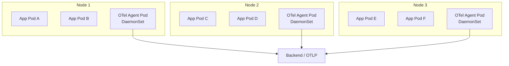
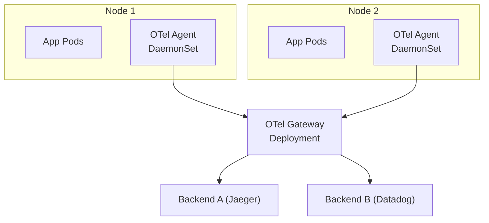
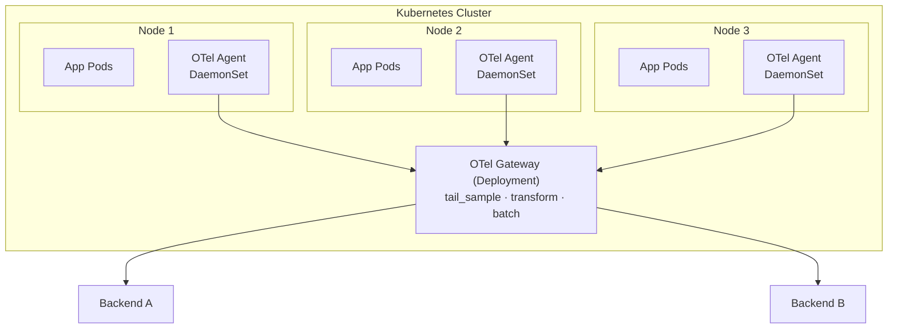
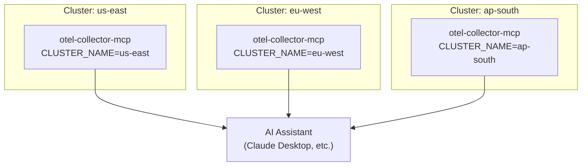
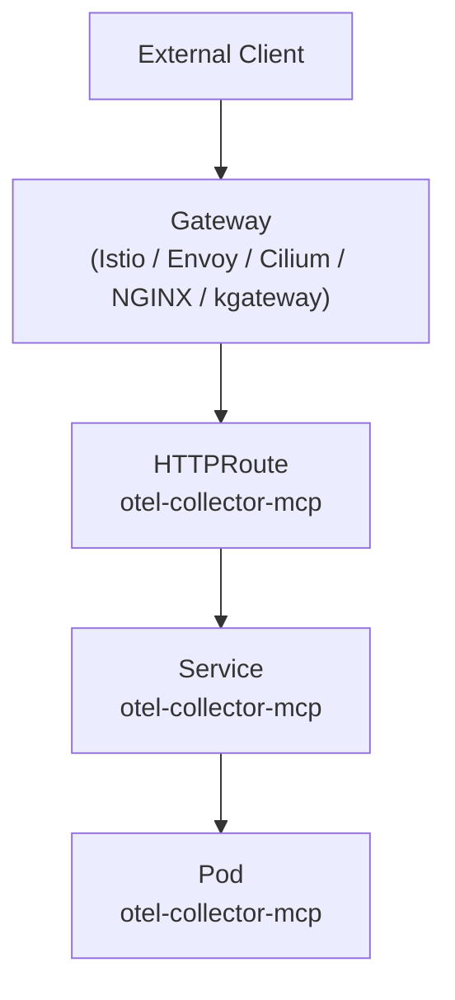
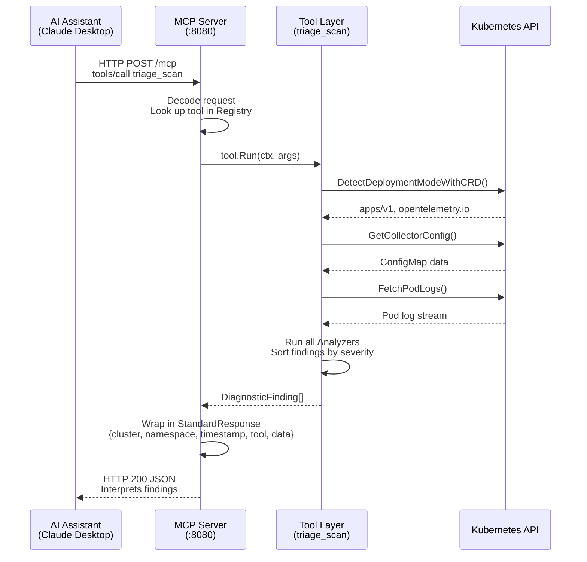
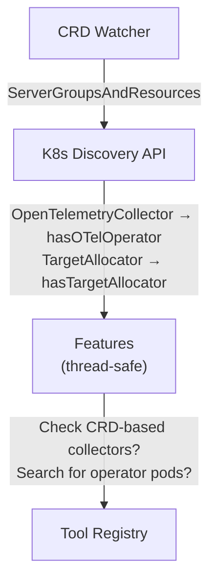

# Architecture Guide

This guide covers OTel Collector deployment patterns, multi-cluster MCP setup, Gateway API exposure, and how data flows through the system.

## Deployment Patterns

otel-collector-mcp understands and can detect four deployment modes for OTel Collectors. Each mode serves different use cases.

### DaemonSet -- Node-Level Collection

A DaemonSet runs one collector pod per node. This is the standard pattern for:

- **Log collection** -- Requires access to `/var/log` and `/var/lib/docker/containers` on each node.
- **Host metrics** -- Node-level CPU, memory, disk, and network metrics via the `hostmetrics` receiver.
- **Low-overhead OTLP reception** -- Accepting telemetry from application pods on the same node over localhost.



**When to use:** Log collection, host metrics, or simple per-node trace/metric forwarding with no need for centralized processing.

### Deployment -- Centralized Gateway

A Deployment runs a configurable number of replicas behind a Kubernetes Service. This pattern is used for:

- **Tail sampling** -- Requires all spans for a given trace to reach the same collector, typically via a load balancing exporter or consistent hashing.
- **Multi-backend fan-out** -- Routing signals to multiple backends (e.g., Jaeger + Datadog).
- **Centralized processing** -- OTTL transforms, filtering, and enrichment that benefit from centralized management.



**When to use:** Tail sampling, multi-backend fan-out, centralized OTTL transforms, or when you need horizontally-scaled processing.

### StatefulSet -- Stateful Processing

A StatefulSet provides stable pod identities and is required when using the **Target Allocator** for Prometheus scraping. The Target Allocator distributes scrape targets across collector pods by name, so pods must have predictable identities.

**When to use:** Prometheus target scraping with the OTel Operator Target Allocator.

### OTel Operator CRD -- Operator-Managed

When the OpenTelemetry Operator is installed, collectors can be managed via the `OpenTelemetryCollector` Custom Resource Definition. The operator handles:

- Creating the underlying Deployment, DaemonSet, or StatefulSet
- Configuration injection
- Sidecar injection for application pods
- Target Allocator management

otel-collector-mcp auto-detects operator-managed collectors by checking for the `opentelemetry.io` API group during CRD discovery.

### Hybrid Agent-to-Gateway

The most common production pattern combines DaemonSet agents with a centralized gateway:



The DaemonSet agents handle:

- Log collection from node filesystems
- Receiving OTLP from local application pods
- Basic processing (memory_limiter, batch)
- Forwarding to the gateway via the `otlp` exporter

The Gateway handles:

- Tail sampling across all traces
- OTTL transforms and enrichment
- Multi-backend fan-out
- Retry and queuing for backend resilience

## Multi-Cluster Setup

In a multi-cluster environment, deploy one otel-collector-mcp instance per cluster. Each instance operates independently with its own Kubernetes ServiceAccount and RBAC permissions.



### Configuration

Set the `CLUSTER_NAME` environment variable (or Helm value `config.clusterName`) for each cluster:

```bash
# US East cluster
helm install otel-collector-mcp deploy/helm/otel-collector-mcp \
  --set config.clusterName=us-east

# EU West cluster
helm install otel-collector-mcp deploy/helm/otel-collector-mcp \
  --set config.clusterName=eu-west
```

### Cluster Identity in Responses

Every MCP response includes the cluster name in the envelope:

```json
{
  "cluster": "us-east",
  "namespace": "observability",
  "timestamp": "2025-01-15T10:30:00Z",
  "tool": "list_collectors",
  "data": { ... }
}
```

This allows the AI assistant to correlate findings, compare configurations, and identify cross-cluster issues (for example, a collector version mismatch between clusters).

### AI Client Configuration

Configure your MCP client with one server entry per cluster:

```json
{
  "mcpServers": {
    "otel-mcp-us-east": {
      "url": "http://us-east-mcp.example.com/mcp"
    },
    "otel-mcp-eu-west": {
      "url": "http://eu-west-mcp.example.com/mcp"
    },
    "otel-mcp-ap-south": {
      "url": "http://ap-south-mcp.example.com/mcp"
    }
  }
}
```

## Gateway API Exposure

The Helm chart includes an optional HTTPRoute resource for exposing the MCP server through the Kubernetes Gateway API. This eliminates the need for `kubectl port-forward` in production environments.

### How It Works

When `gateway.enabled=true`, the chart creates an HTTPRoute that routes HTTP traffic from a Gateway resource to the otel-collector-mcp Service:



### Supported Providers

The HTTPRoute uses the standard `gateway.networking.k8s.io/v1` API, which is supported by:

| Provider | Gateway Class Name | Notes |
|---|---|---|
| Istio | `istio` | Istio's gateway implementation |
| Envoy Gateway | `eg` | Envoy-based Gateway API implementation |
| Cilium | `cilium` | eBPF-based networking with Gateway API support |
| NGINX Gateway Fabric | `nginx` | NGINX-based Gateway API implementation |
| kgateway | `kgateway` | Formerly Gloo Gateway |

### Configuration

```yaml
gateway:
  enabled: true
  className: "istio"            # Name of your Gateway resource
  hostname: "otel-mcp.example.com"  # Optional hostname filter
  port: 8080
  tls:
    enabled: true               # Enable HTTPS via the Gateway
    certificateRef:
      name: "otel-mcp-tls"     # TLS certificate Secret name
      namespace: "observability"
  annotations: {}               # Optional annotations for the HTTPRoute
```

### TLS Configuration

When TLS is enabled, the HTTPRoute references the `https` section of the parent Gateway. The Gateway itself must be configured with the TLS certificate. The HTTPRoute simply routes traffic that arrives on the Gateway's HTTPS listener.

!!! warning
    The MCP server itself serves plain HTTP. TLS termination happens at the Gateway. Ensure your Gateway is properly configured with TLS certificates before enabling this option.

## Data Flow Diagram

The following diagram shows how data flows through otel-collector-mcp when an AI assistant invokes a tool:



### CRD Discovery Flow

On startup and every 30 seconds, the CRD watcher queries the Kubernetes discovery API:



This dynamic discovery means otel-collector-mcp adapts automatically when the OTel Operator is installed or removed -- no restart required.
