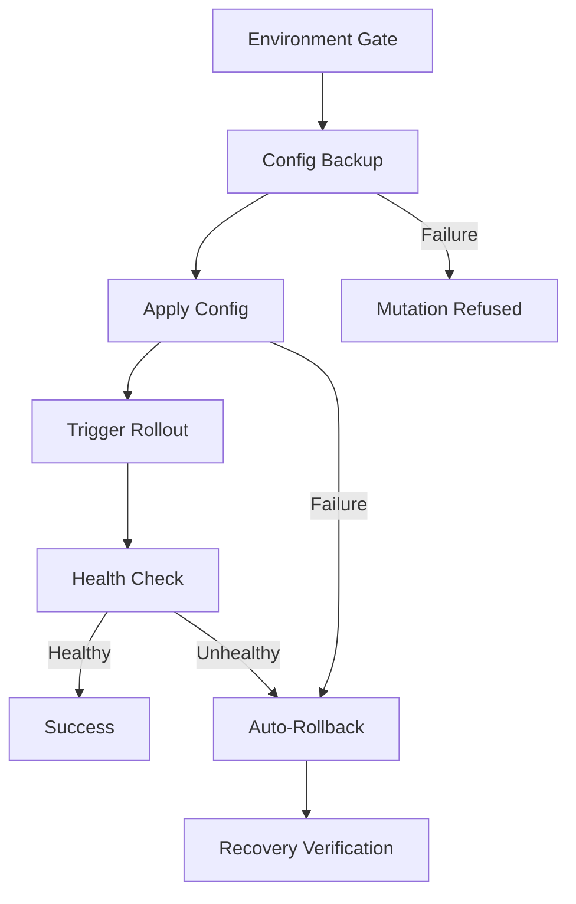

# Safety Model

v2 mutations follow a strict safety chain that prevents configuration damage and ensures automatic recovery. Every config change goes through five sequential gates.

## Safety Chain

## Gate 1: Environment Gate

Users must declare the environment when starting an analysis session:

| Environment | Mutations Allowed | Override Available |
|-------------|:-----------------:|:------------------:|
| `dev` | Yes | — |
| `staging` | Yes | — |
| `production` | **No** | **None** |

Production sessions are refused with error code `PRODUCTION_REFUSED`. There is no force flag, CLI override, or escape hatch. This is an absolute gate.

## Gate 2: Config Backup

Before any mutation, the full current configuration is stored as a Kubernetes annotation:

- **Annotation key:** `mcp.otel.dev/config-backup`
- **Content:** Full JSON serialization of the config (ConfigMap `.data` or CRD `.spec`)
- **Session tracking:** `mcp.otel.dev/session-id` annotation set on the resource

If the backup fails, the entire mutation is refused. No config changes are made.

### ConfigMap Collectors

The full `.data` section of the ConfigMap is serialized to JSON and stored in the annotation.

### OTel Operator CRD Collectors

The full `.spec` of the OpenTelemetryCollector CR is serialized to JSON and stored in the annotation.

## Gate 3: Apply Config

The new configuration is merged into the collector's config:

- **ConfigMap:** Only the config key is updated (other keys preserved)
- **CRD:** New config merged into `spec.config`

If the apply fails, automatic rollback is triggered immediately.

## Gate 4: Trigger Rollout

A workload restart is triggered to pick up the new config:

| Workload Type | Rollout Mechanism |
|---------------|-------------------|
| Deployment | Annotation patch (`kubectl.kubernetes.io/restartedAt`) |
| DaemonSet | Annotation patch |
| StatefulSet | Annotation patch |
| OTel Operator CRD | Operator auto-detects spec changes |

Rollout trigger failure is **non-fatal** — the system continues to the health check, since the operator or controller may still pick up changes.

## Gate 5: Health Check

After rollout, pod health is polled every **2 seconds** for up to **30 seconds**:

| Condition | Result |
|-----------|--------|
| All pods Running + Ready | **Success** |
| Any pod in CrashLoopBackOff | **Auto-rollback** |
| Any pod not Ready after 30s | **Auto-rollback** |

### Health Status Values

| Status | Meaning |
|--------|---------|
| `healthy` | Pod Running, Ready condition true, no restarts |
| `crash_loop` | Container in CrashLoopBackOff |
| `not_ready` | Pod Running but Ready condition false |
| `not_found` | No pods matching label selector |
| `unhealthy` | Other failure state |

## Auto-Rollback

When a health check fails:

1. The backup annotation is read
2. The original config is restored
3. A rollout restart is triggered
4. **Recovery verification** confirms the collector returns to healthy state

If rollback itself fails, a `ROLLBACK_FAILED` error is raised — this is a critical state requiring manual intervention.

## GitOps Awareness

`start_analysis` checks for GitOps management annotations:

| Annotation | System |
|------------|--------|
| `argocd.argoproj.io/managed-by` | ArgoCD |
| `fluxcd.io/automated` | Flux |

If detected, a `GITOPS_CONFLICT` warning is returned. The session still proceeds, but the user is warned that mutations may be reverted by the GitOps controller.

## Session Management

| Setting | Default | Description |
|---------|---------|-------------|
| Max concurrent sessions | 5 | Across all collectors |
| Collector exclusivity | 1 session per collector | Prevents conflicting mutations |
| Session TTL | 10 minutes | Inactivity timeout |
| Cleanup interval | 30 seconds | Background expiry sweep |

### Orphan Recovery

On server startup, `RecoverOrphanedSessions()` scans all namespaces for resources with `mcp.otel.dev/session-id` annotations that no longer have active sessions. These are cleaned up automatically (debug exporters removed, annotations cleared).

## Annotation Reference

| Annotation | Purpose |
|------------|---------|
| `mcp.otel.dev/session-id` | Tracks which session owns the resource |
| `mcp.otel.dev/config-backup` | Stores the full pre-mutation config |
| `kubectl.kubernetes.io/restartedAt` | Triggers workload rollout |

## Error Codes

| Code | Gate | Description |
|------|------|-------------|
| `PRODUCTION_REFUSED` | Environment | Production environment blocked |
| `BACKUP_FAILED` | Backup | Config backup could not be created |
| `MUTATION_FAILED` | Apply | Config could not be applied |
| `HEALTH_CHECK_FAILED` | Health Check | Pods did not become healthy |
| `ROLLBACK_FAILED` | Rollback | Critical: rollback itself failed |
| `GITOPS_CONFLICT` | Session Start | Warning: GitOps controller detected |
