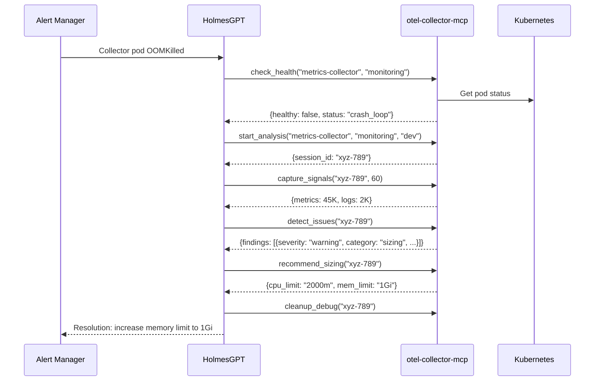

# HolmesGPT Integration

[HolmesGPT](https://github.com/robusta-dev/holmesGPT) is an open-source AI agent for Kubernetes incident investigation. This guide shows how to connect HolmesGPT to otel-collector-mcp for collector-aware diagnostics.

## Prerequisites

- HolmesGPT installed and configured
- otel-collector-mcp deployed with v2 enabled
- Network connectivity between HolmesGPT and the MCP server

## Architecture

HolmesGPT connects to otel-collector-mcp via MCP over streamable HTTP. For remote setups, use [Supergateway](https://github.com/nicholasgasior/supergateway) as a stdio-to-HTTP bridge.

```
HolmesGPT → (HTTP) → otel-collector-mcp MCP server → Kubernetes API
```

## Configuration

### Direct Connection

Add the MCP server to your HolmesGPT configuration:

```yaml
# holmes-config.yaml
mcp_servers:
  - name: otel-collector-mcp
    url: "http://otel-collector-mcp.otel-mcp.svc.cluster.local:8080/mcp"
    transport: streamable-http
```

### Supergateway Setup (Remote Access)

If HolmesGPT runs outside the cluster, use Supergateway to expose the MCP server:

```bash
# Install Supergateway
npm install -g supergateway

# Bridge the MCP server to stdio
supergateway --streamableHttp http://otel-collector-mcp.otel-mcp.svc.cluster.local:8080/mcp
```

Or deploy Supergateway as a sidecar:

```yaml
apiVersion: apps/v1
kind: Deployment
metadata:
  name: supergateway-bridge
spec:
  template:
    spec:
      containers:
        - name: supergateway
          image: node:20-slim
          command: ["npx", "supergateway", "--streamableHttp", "http://otel-collector-mcp.otel-mcp.svc.cluster.local:8080/mcp", "--port", "8081"]
          ports:
            - containerPort: 8081
```

Then configure HolmesGPT to connect to the Supergateway endpoint:

```yaml
mcp_servers:
  - name: otel-collector-mcp
    url: "http://supergateway-bridge.otel-mcp.svc.cluster.local:8081/mcp"
    transport: streamable-http
```

## Example Prompts

### Investigate OOMKilled collectors

```
A collector pod was OOMKilled in the "monitoring" namespace. Check the health
of "metrics-collector", start a dev analysis session, capture 120 seconds of
signals, and run recommend_sizing to determine appropriate resource limits.
```

### Diagnose high error rates

```
The "gateway-collector" in "observability" is showing elevated error rates.
Check its health, then analyze it in a staging session. Capture signals for
60 seconds and run detect_issues. Report all findings sorted by severity.
```

### PII compliance check

```
Run a PII scan on "log-collector" in the "logging" namespace. Start a dev
session, capture 120 seconds of log data, detect issues, and report any
PII findings with the affected attributes and suggested remediation.
```

### Full investigation flow

```
Investigate "trace-gateway" in "observability" (staging environment):
1. Check its health
2. Start an analysis session
3. Capture signals for 120 seconds
4. Detect all issues
5. Get fix suggestions
6. Report findings with recommendations
7. Clean up the debug session
```

## Complete Workflow Example



## Tips

- HolmesGPT can chain otel-collector-mcp tools with its built-in Kubernetes tools for richer investigations
- Use `check_health` as a triage step before committing to a full analysis session
- For incident response, keep `duration_seconds` short (30s) to get fast results
- Always include `cleanup_debug` in your investigation prompts to avoid orphaned sessions
