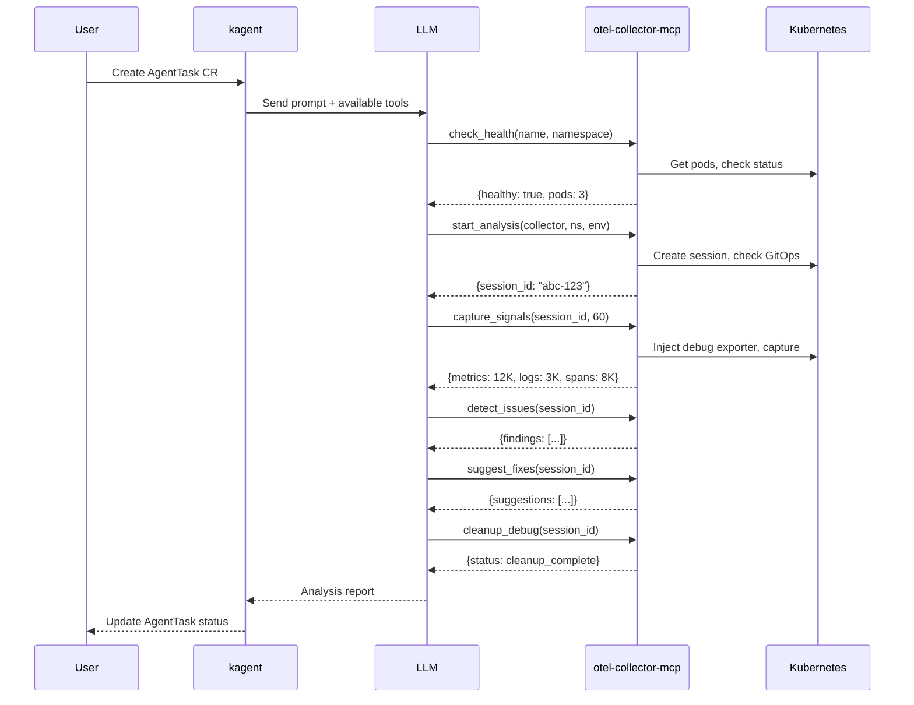

# kagent Integration

[kagent](https://github.com/kagent-dev/kagent) is a Kubernetes-native AI agent framework that runs agent tasks as Custom Resources. This guide shows how to use otel-collector-mcp as an MCP server with kagent for automated collector analysis.

## Prerequisites

- kagent installed in your cluster
- otel-collector-mcp deployed with v2 enabled
- `kubectl` access to create AgentTask CRs

## Architecture

```
kagent Controller → AgentTask CR → LLM (with MCP tools) → otel-collector-mcp → Kubernetes API
```

kagent sends tool calls to the otel-collector-mcp MCP server, which executes them against the Kubernetes API.

## Configuration

### 1. Register otel-collector-mcp as an MCP server

Create a kagent `Tool` CR that points to the MCP server:

```yaml
apiVersion: kagent.dev/v1
kind: Tool
metadata:
  name: otel-collector-mcp
  namespace: kagent
spec:
  type: mcp
  mcp:
    url: "http://otel-collector-mcp.otel-mcp.svc.cluster.local:8080/mcp"
    transport: streamable-http
```

### 2. Create an Agent with the MCP tools

```yaml
apiVersion: kagent.dev/v1
kind: Agent
metadata:
  name: otel-analyzer
  namespace: kagent
spec:
  model:
    provider: anthropic
    name: claude-sonnet-4-6
  systemPrompt: |
    You are an OpenTelemetry Collector analyst. You have access to MCP tools
    that can inspect and analyze collectors running in Kubernetes.

    When asked to analyze a collector:
    1. Check its health with check_health
    2. Start an analysis session with start_analysis (use environment "dev" or "staging", never "production")
    3. Capture signals with capture_signals (60-120 seconds)
    4. Run detect_issues to find anti-patterns
    5. Use suggest_fixes to generate remediation configs
    6. Always run cleanup_debug when finished

    Present findings in a structured format with severity, category, and recommended actions.
  tools:
    - otel-collector-mcp
```

## AgentTask Examples

### Analyze a specific collector

```yaml
apiVersion: kagent.dev/v1
kind: AgentTask
metadata:
  name: analyze-gateway
  namespace: kagent
spec:
  agentRef: otel-analyzer
  prompt: |
    Analyze the collector "gateway-collector" in namespace "observability".
    Environment is "staging". Capture signals for 60 seconds, detect issues,
    and suggest fixes. Clean up when done.
```

### Health check across multiple collectors

```yaml
apiVersion: kagent.dev/v1
kind: AgentTask
metadata:
  name: health-sweep
  namespace: kagent
spec:
  agentRef: otel-analyzer
  prompt: |
    Check the health of these collectors:
    - "metrics-collector" in namespace "monitoring"
    - "log-collector" in namespace "logging"
    - "trace-gateway" in namespace "observability"
    Report any unhealthy pods.
```

### Capacity planning

```yaml
apiVersion: kagent.dev/v1
kind: AgentTask
metadata:
  name: sizing-analysis
  namespace: kagent
spec:
  agentRef: otel-analyzer
  prompt: |
    Analyze the collector "metrics-collector" in namespace "monitoring"
    (environment: "dev"). Capture 120 seconds of signals, then run
    recommend_sizing and recommend_sampling. Provide resource and
    sampling recommendations.
```

## Example Investigation Flow

A complete investigation using kagent follows this sequence:



## Monitoring AgentTask Progress

```bash
# Watch task status
kubectl get agenttask analyze-gateway -n kagent -w

# View task output
kubectl describe agenttask analyze-gateway -n kagent
```

## Tips

- Set `environment` to `"dev"` or `"staging"` — production is always refused
- For long captures, increase the kagent task timeout
- Use `check_health` before `start_analysis` to fail fast on unreachable collectors
- One analysis session per collector at a time — kagent tasks targeting the same collector will get `CONCURRENT_SESSION` errors
