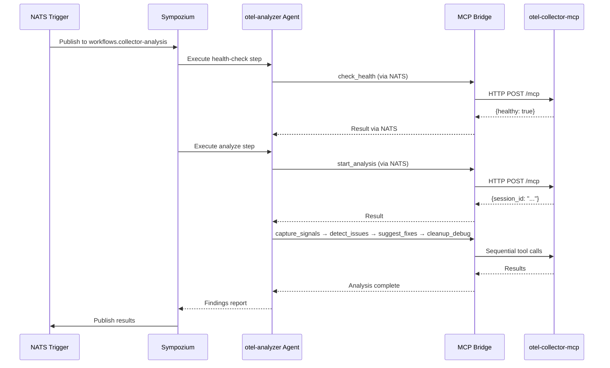

# Sympozium Integration

[Sympozium](https://github.com/humancloud/sympozium) is a multi-agent orchestration platform that uses NATS for agent communication. This guide shows how to connect otel-collector-mcp as a tool provider in Sympozium workflows.

## Prerequisites

- Sympozium platform deployed
- NATS server running and accessible
- otel-collector-mcp deployed with v2 enabled
- A Sympozium-compatible MCP bridge (NATS ↔ HTTP)

## Architecture

```
Sympozium Agent → NATS → MCP Bridge → otel-collector-mcp → Kubernetes API
```

Sympozium agents communicate over NATS. An MCP bridge translates NATS messages to MCP tool calls against the otel-collector-mcp HTTP endpoint.

## Configuration

### 1. Deploy the MCP bridge

The bridge subscribes to a NATS subject and forwards tool calls to the MCP server:

```yaml
apiVersion: apps/v1
kind: Deployment
metadata:
  name: mcp-nats-bridge
  namespace: sympozium
spec:
  replicas: 1
  template:
    spec:
      containers:
        - name: bridge
          image: sympozium/mcp-nats-bridge:latest
          env:
            - name: NATS_URL
              value: "nats://nats.sympozium.svc.cluster.local:4222"
            - name: MCP_SERVER_URL
              value: "http://otel-collector-mcp.otel-mcp.svc.cluster.local:8080/mcp"
            - name: NATS_SUBJECT
              value: "tools.otel-collector-mcp"
```

### 2. Register the tool provider in Sympozium

```yaml
# sympozium-agent-config.yaml
agents:
  - name: otel-analyzer
    description: OpenTelemetry Collector analysis agent
    tools:
      - provider: mcp
        name: otel-collector-mcp
        nats_subject: "tools.otel-collector-mcp"
        capabilities:
          - check_health
          - start_analysis
          - capture_signals
          - detect_issues
          - suggest_fixes
          - apply_fix
          - recommend_sampling
          - recommend_sizing
          - rollback_config
          - cleanup_debug
    system_prompt: |
      You analyze OpenTelemetry Collectors for performance and compliance issues.
      Always declare environment as "dev" or "staging" — never "production".
      Follow the analysis loop: start_analysis → capture_signals → detect_issues → suggest_fixes → cleanup_debug.
```

## NATS-Based Workflow Example

### Workflow definition

```yaml
# workflow: collector-health-check
name: collector-health-check
trigger:
  type: nats
  subject: "workflows.collector-analysis"

steps:
  - name: health-check
    agent: otel-analyzer
    prompt: |
      Check health of collector "{{ .collector_name }}" in namespace "{{ .namespace }}".

  - name: analyze
    agent: otel-analyzer
    condition: "{{ .steps.health_check.result.healthy == true }}"
    prompt: |
      Start a {{ .environment }} analysis session for "{{ .collector_name }}"
      in "{{ .namespace }}". Capture signals for 60 seconds, detect issues,
      and suggest fixes. Report findings and clean up.

  - name: report
    agent: reporter
    prompt: |
      Format the analysis findings into a Slack-friendly summary with
      severity counts and top recommendations.
```

### Trigger the workflow via NATS

```bash
nats pub workflows.collector-analysis '{
  "collector_name": "gateway-collector",
  "namespace": "observability",
  "environment": "staging"
}'
```

### Multi-agent coordination

```yaml
# workflow: fleet-analysis
name: fleet-analysis
trigger:
  type: schedule
  cron: "0 6 * * 1"  # Weekly Monday 6 AM

steps:
  - name: discover
    agent: k8s-explorer
    prompt: |
      List all OpenTelemetry Collectors across all namespaces.

  - name: analyze-each
    agent: otel-analyzer
    for_each: "{{ .steps.discover.result.collectors }}"
    prompt: |
      Analyze collector "{{ .item.name }}" in namespace "{{ .item.namespace }}"
      (environment: "dev"). Capture 60 seconds of signals, detect issues,
      and report findings. Clean up when done.

  - name: aggregate
    agent: reporter
    prompt: |
      Compile all collector analysis results into a fleet health report.
      Highlight any collectors with critical or error-severity findings.
```

## Complete Workflow Example



## Tips

- Use NATS request-reply for synchronous tool calls and pub-sub for async workflows
- Set appropriate timeouts on NATS requests — `capture_signals` can take up to 120 seconds
- The MCP bridge should handle reconnection to both NATS and the MCP server
- For fleet-wide analysis, stagger sessions to avoid hitting `maxConcurrentSessions` limits
- Always include `cleanup_debug` in workflow steps to prevent orphaned sessions
